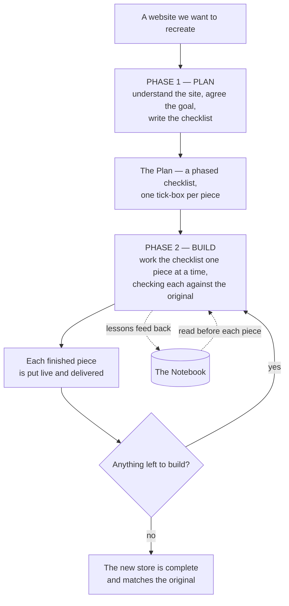
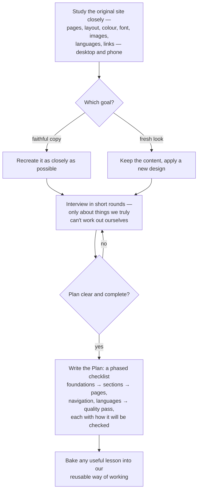
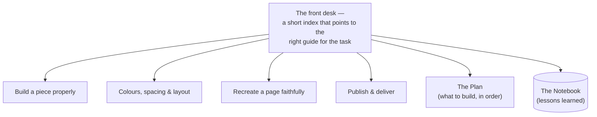
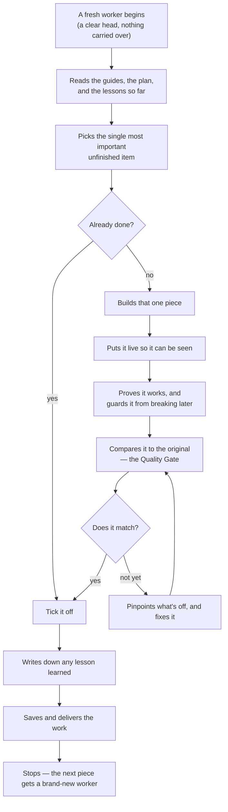
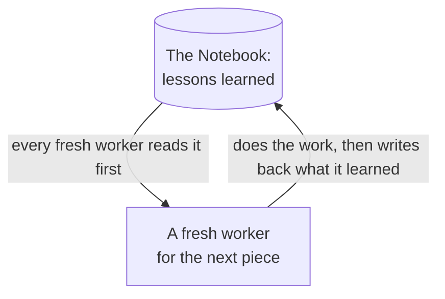
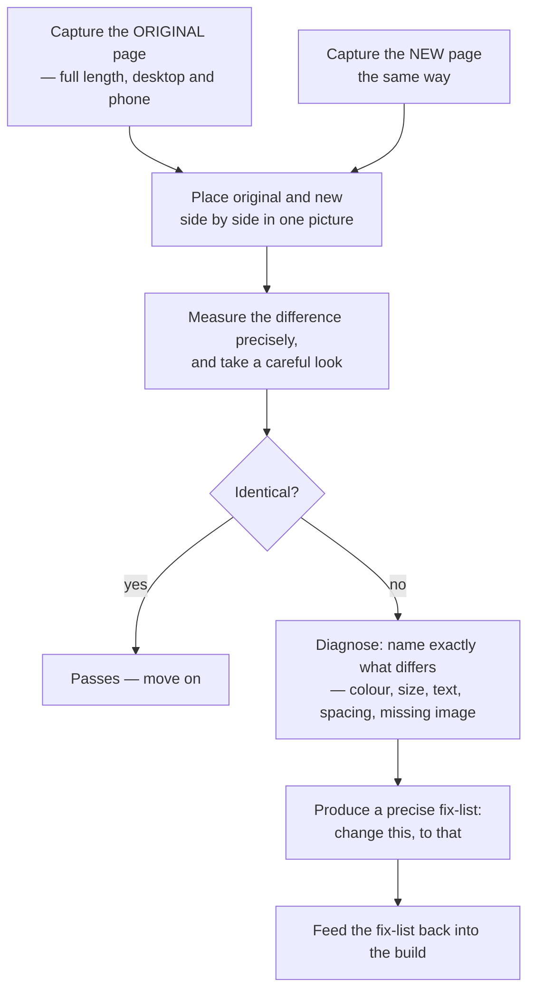
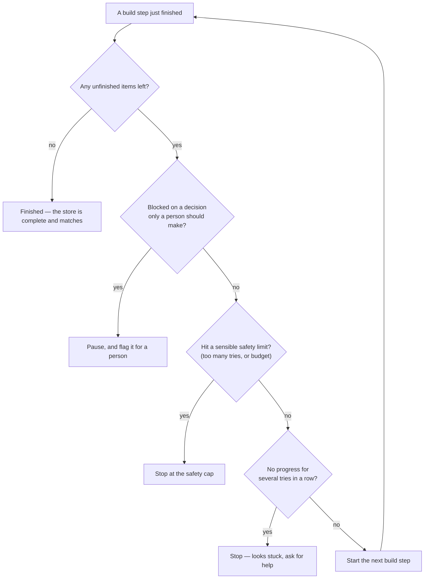

# How the Approach Works

> A plain-language tour of the whole approach — the logic, end to end, step by step.

**The big idea, in one line:** instead of rebuilding a website by hand, we turn the work into a calm, repeating routine — plan it, then build one piece at a time, checking each against the original — until the new store is a faithful, reusable copy.

A few characters appear throughout:

- **The Plan** — a checklist of every piece the site needs, one tick-box each, in sensible order.
- **The Knowledge Base** — a front desk that points to the right guide for whatever the task is.
- **The Worker** — handles exactly one piece, then hands off. Each piece gets a fresh Worker with a clear head.
- **The Quality Gate** — compares each new piece to the original, on desktop *and* phone.
- **The Notebook** — the shared memory: lessons learned, kept for everyone after.

---

## 1. The whole journey

There are two phases: first we **plan**, then we **build** — one piece at a time, checking each, until nothing is left. Lessons learned along the way flow back into the shared memory, so the work keeps getting sharper.

---

## 2. Phase 1 — Making the plan

We study the original closely — every page, layout, colour, font, image, language and link, on desktop and phone — and agree the goal: a faithful copy, or a fresh design that keeps the content. Then we interview in short rounds, **but only about things we genuinely can't work out ourselves**, until the plan is clear. Finally, we bake any useful lesson into our reusable way of working, so the next project starts smarter.

---

## 3. What every Worker leans on — the Knowledge Base

Nothing is done from memory or guesswork. A short front desk points to the right guide for the task at hand, plus the Plan and the Notebook. Each Worker reads the front desk first and opens **only** the guides its piece needs — keeping its head clear. For anything about the platform itself, it trusts the official guidance rather than guessing.

---

## 4. Phase 2 — One build step

Every piece follows the same gentle routine. A fresh Worker reads the guides, the plan and the lessons, picks the single most important unfinished item, checks it isn't already done, builds it, puts it live, proves it works, and compares it to the original. If something is off, it pinpoints the difference and fixes it; once it matches, it ticks the item, notes any lesson, saves and delivers — then stops. The next piece gets a brand-new Worker.

---

## 5. A fresh start every time — yet it remembers

Why a new Worker for each piece? Because a clear head makes fewer mistakes than a tired one juggling everything at once. The trick is the Notebook: each Worker reads it before starting and writes back what it learned afterwards. So the work stays focused, while the knowledge quietly builds up.

---

## 6. What "building it properly" means

Two quiet rules make the result durable, not throwaway:

- **Every piece is a reusable building block.** It has a plain, neutral name, adjustable colours, spacing and layout, works on desktop and phone, and keeps its wording editable. So the owner ends up with a proper, flexible store they can keep changing — not a one-off that only fits today.
- **We recreate everything, not just the look.** Every page, section, article and link the original had is rebuilt, so nothing goes missing — not only the home page, and not only the visuals.

---

## 7. How we know it's actually right

We never just trust that it "looks close." For every piece we photograph the original and the new version the same way — the full length of the page, on desktop and phone — and place them side by side. We measure the difference precisely *and* take a careful look. If anything is off, we don't guess: we name exactly what differs — a colour, a size, a piece of text, spacing, or a missing image — and turn that into a precise fix-list, which goes straight back into the build.

---

## 8. Delivering, and knowing when to stop

Every finished piece is delivered to two places automatically — the live store, and a clean copy kept in sync for the platform — so what we build and what goes live always stay in step.

And the routine has clear stopping points, so it never wanders. After each piece we ask, in order: Is everything built? Are we blocked on something only a person should decide? Have we hit a sensible safety limit? Are we making no progress? Any "yes" ends it cleanly — finished, paused for a person, or flagged for help. Otherwise, on to the next piece.

---

## Why this works

- **Faithful** — every piece is checked against the original, on desktop and phone, before it counts as done.
- **Steady** — small, focused steps with a clear head each time, so quality doesn't drift.
- **Self-correcting** — when something's off, we pinpoint the exact change, not a vague "make it better."
- **Durable** — the result is a reusable, editable store, with every page recreated, not a throwaway.
- **It remembers** — lessons are written down once and reused by everyone after, so each project starts smarter than the last.
- **It knows when to stop** — finished, blocked, or stuck each have a clear, safe ending.
